## 第一章导论
1.操作系统的特征：并发、共享、异步性、虚拟。其中并发和共享是两个最基本的特征
2.操作系统的抽象表示
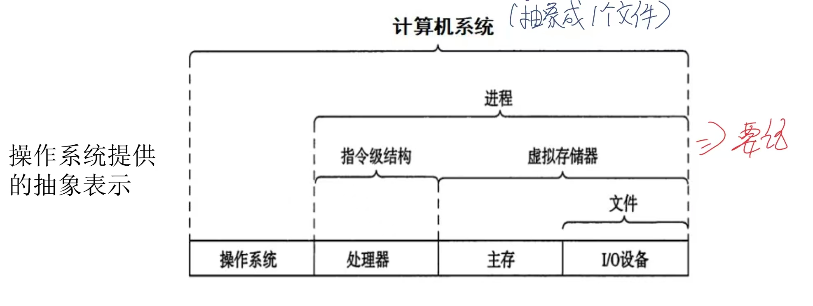
3.存储器层次结构：
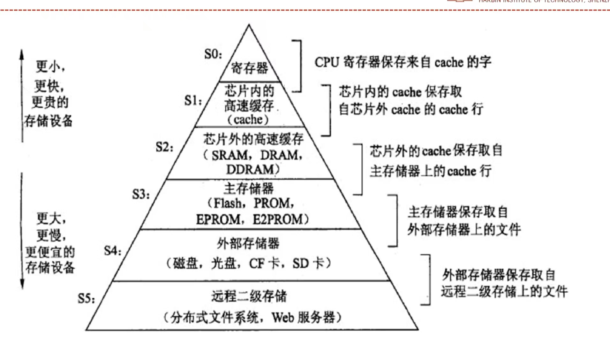

## 第二章第一部分 进程 
1.进程的定义：正在运行的程序的一个实例(动态性)
2.进程的组成：PCB+程序+数据
3.进程是**系统进行除cpu外的资源分配**的基本单位
4.一个程序可以对应多个进程；通过调用关系，一个进程可以执行多个程序。
5.进程的三种基本状态：就绪状态(获得了除cpu以外的一切资源)、运行状态、阻塞状态。
6.进程五状态：加了新建状态（至少建立了PCB）、终止状态
7.进程七状态：多了就绪挂起和阻塞挂起
8.进程的创建——fork函数：
    1）**父进程返回子进程的pid，子进程返回0**
    2）调用一次，返回两次值

9.进程图：
    1）a->b代表a在b之前发生
    2）每个节点都是一个语句的执行
    3）**多次fork调用求运行序列的题可以使用流程图来解决**

10.进程的终止——exit函数
    1）终止程序
    2）约定：正常结束时返回0（参数填0），错误时返回非0值
    3）exit()调用一次永不返回
11.exit与return的区别：如果是在被调用的自定义函数当中，使用return会返回调用它的函数；而exit会直接退出整个进程，不往下继续运行。二者在main函数中的现象基本一致。
12.进程的唤醒：进程被阻塞后如果被唤醒，会从阻塞态变为就绪态，而不是直接进入运行态。
13.并发的进程：两个逻辑流在宏观上有重叠
14.并发的实际刻画：宏观上在多道程序在同时运行，微观上这些程序是交替执行的。
15.**wait函数：
    1）wait在父进程中阻塞，等待子进程的结束
    2）如果子进程结束，返回子进程id。
    3）wait()函数用于回收子进程，释放资源**

16.**waitpid函数：
    1）阻塞当前进程，等待一个特定的进程，直到这个特定的子进程结束在结束阻塞
    2）如果设置选项WNOHANG，则waitpid函数不阻塞继续向下执行
    3）当正常返回也是返回子进程pid**
17.wait函数和waitpid函数的区别：wait函数是遍历当前进程的子进程列表，只要有一个退出就会进行回收。而waitpid函数是等待一个特定的进程，直到这个特定的子进程结束在结束阻塞
18**僵尸进程**：子进程退出，父进程正在运行，却并未调用wait或waitpid来回收子进程，这样子进程仍然保存在系统中，此进程为僵尸进程。（当父进程结束时，子进程会被init进程回收）
19.**孤儿进程**：父进程退出，但其子进程还在运行，那么这些子进程就会成为孤儿进程。（孤儿进程会被init进程收养，并且如果不显式杀死子进程，否则将永远运行）

20.sleep函数——进程的休眠
    1）阻塞进程一段时间，此时进程为阻塞态
    2）让程序休眠指定的时间，然后返回0.如果因为信号中断而结束休眠，则返回剩下未休眠的秒数

21.pause函数：使调用程序进入休眠状态，直到进程接受到信号为止
22.**execve函数**：加载并运行新程序，将新程序装载到当前进程运行。
23.fork()和exec()组合完成一个新的进程的完整创建过程
24.异常：为相应某些事件，将控制权交给OS内核
25.异常的总结表

26.从上图而言看出：
    1）异常分为：中断、陷阱、故障和终止，后面三个称之为
    2）其中只有中断是异步故障、其他都为同步故障；中断和陷阱是返回下一条指令，故障是可能返回到当前指令
    3）中断原因包括：时钟中断、IO设备的终端信号
    4）陷阱：系统调用（有意的异常）
    5）故障：故障：缺页、浮点异常（可恢复的错误）
    6）终止：不可恢复的错误（终止当前程序）

27.进程间通信包括：
    1）共享内存系统（通信速度最快，会有写冲突）
    2）消息传递系统
    3）管道

28.消息传递系统包括：消息缓冲队列（直接通信）、信箱通信（间接通信）
29.管道要点：
    1）管道用于连接一个写进程和一个读进程，是一个实现他们之间通信的文件
    2）管道中的数据一被读取，数据就从管道中被抛弃
    3）单个管道只能进程单向通信，要实现双方互动通信，必须定义两个管道。
30.管道通信机制的协调能力
    1.互斥：某一时刻只能单向传输，
    2.同步：当写（输入）进程把一定数量的数据写入pipe后，便去睡眠等待，直到读进程取走数据后将其唤醒；当读进程读一空pipe,也应睡眠等待，直至写进程将数据写入管道，才将其唤醒。
    3.确认对方是否存在
31.管道式一种特殊文件：管道的初始化实现已经实现了open的操作
32.一个管道可以有多个读写进程对其操作

## 第二章第二部分 线程
1.线程的组成：TCB+堆栈+一组寄存器
2.线程的基本状态：就绪、运行、阻塞状态。
3.线程是CPU调度和分配的基本单元（是调度的基本单元）
4.**易错**：进程是资源分配的基本单位，而线程是调度的基本单位
5.线程并不单独拥有系统资源，同一进程下的不同线程拥有进程的全部资源
6，进程是为了保护独立的地址空间，线程是为了更好地支持并发
7.进程与线程的关系与区别：
    1）进程是系统进行除cpu外资源分配的基本单元，线程是CPU调度和分配的基本单位
    2）线程是是进程的一部分，一个进程可以有多个线程，而一个线程只属于一个进程。
    3）线程之间共享所属进程的全部资源

8.进程和线程的共同点：
    1）都有着自己的控制流
    2）都能够并发的执行
    3）都需要进行切换上下文的操作
9.不同点：
1）线程共享所属进程的全部资源，但进程之间不共享，进程拥有独立的地址空间
2）线程切换的开销比进程小

10.用户线程的管理（创建、撤销、切换和调度）不需要内核支持，是由用户程序（用户程序通过调用线程库提供的接口来管理）在用户态来管理（所以用户线程的切换不进入内核态，不需要内核支持）
11.内核线程是由操作系统来直接管理和支持
12.用户线程与内核线程的多线程模型分类：
1）多对一模型（不能并行运行在多核系统）
2）一对一模型（允许多线程并行运行在多核系统，但创建内核线程过多会影响性能）
3）多对多模型（比较常见，内核线程的数量小于等于用户线程）
4）双层模型：在多对多模型的基础上，允许某个用户级线程绑定一个内核线程

13.创建线程pthread_create：成功返回0，不成功返回非0值。
14.多线程的执行速度不一定比单线程块（如果是单核，多线程还需要加上线程间切换的额外开销）
15.pthread_create第四个参数是传给执行程序的参数，这个参数需要一个指针类型，所以不能传一个多线程的共用变量t，而是新建一个数组，使用``arr[t]=t``,调用时传入``arr+t``来传递参数
16.线程终止函数pthread_exit与exit的区别：主线程调用了pthread_exit，回会等待所有其他线程终止后再终止主线程，而调用exit时，整个进程都会终止。
17.pthread_cancel并不等于线程终止，它只是提出一个请求（并给出一个取消点，当到达此取消点时，线程会检查是否请求被取消并按照请求进行动作）
18.pthread join()函数是阻塞调用线程，直到tid线程终止，并且会回收线程资源（与wait函数不同，此函数可以等待特定线程终止）

### 王道补充内容
1.c语言编写的程序在使用内存时分为3个段：
1）正文段（存放code和data，即常量和全局变量还有代码段）
2）数据堆段（动态分配的存储区）
3）数据栈段：（临时变量和函数实参、函数等）

2.进程与程序的**根本区别**是动态与静态特点
3.进程的生命周期是不连续的（因为等待资源或抢占cpu暂停运行）
4.共享变量的操作结果与执行速度有关（执行速度会影响进程间的执行顺序和内存冲突问题）
5.优先级分为静态和动态两种，动态优先级可以调整
6.单核状态下，有可能没有进程处于运行态（有可能系统发生死锁，所有进程都处于阻塞态）
7.一个程序一次执行可产生多个进程(fork函数，执行一次，返回两次)
8.终端用户登录系统、作业调度、系统提供服务、用户程序的应用请求都会引起进程的创建，但是设备分配不会引起进程的创建（设备分配时通过设置数据结构实现，比如分块分页）
9.通道可以使CPU和I/O并行工作
10.只有从运行态到阻塞态的转换是进程自身决定的
11.线程不一定都比进程小，当一个进程就只有一个线程时，线程和进程是一样大的。
12.管道是一种文件，所以两个进程可以利用文件系统交换数据，但是不能利用全局变量来交换数据
13.用户线程的切换比内核线程的切换效率高
14.用户级线程的线程控制块TCb是由用户程序建立，不是由操作系统将建立（用户线程的管理（创建、撤销、切换和调度）不需要内核支持）
15.临界资源只能同时被一个进程使用
16.fork中的父子进程不共享虚拟地址空间（进程有独立的地址空间）
17.系统中既没有运行进程、也没有就绪进程，说明不不了系统中没有进程（因为有可能系统发生死锁，所有进程都处于阻塞状态）

## 第五章 CPU（处理器）调度
1.单道道批处理系统：每次内存中仅存放一道作业，并且只有这个作业执行完以后才会执行其他作业。
2.多道批处理系统：允许多个程序都进入内存并允许它们在cpu中交替的运行，同样地只有内存中的作业完成时才可以有新的作业进入从就绪队列进入内存。
3.cpu调度的对象是进程或者线程，也就是说进程、线程（用户级、内核级）都能被调度，所以用任务来代表需要被调度执行的工作单元。
4.非抢占式调度：任务完成或阻塞才会主动让出CPU，否则一直执行（批处理系统）
5.抢占式调度：操作系统将正在运行带份进程强行暂停，由调度程序将cpu分配给其他就绪进程，比如**时间片到了，或出现了优先级更高的进程**（交互式系统）
6.cpu约束型程序（约束即聚集）：以计算为主，cpu区间会较多，还有少量长的cpu区间
7.i/o约束型程序：以io为主，但是配合i/o处理也会有大量的短的cpu区间
8.进程中，短的cpu区间出现的频率极高
9.三个时间（**重点**）：
**1）周转时间:任务完成时刻减去任务首次到就绪队列的时刻
  2）等待时间：任务在就绪队列等待的时间总和
  3）响应时间从任务到达就绪队列到首次运行的时间**
10.周转时间最长，等待时间次之、响应时间最短
11.响应时间<=等待时间，因为如果一个进程被调度多次，那么等待时间就大于响应时间
12.**cpu调度算法汇总**：
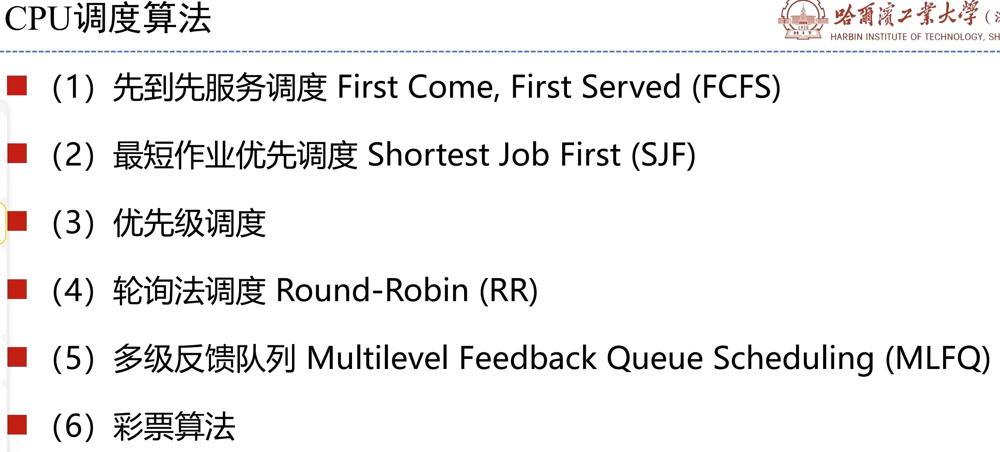
13.先到先服务调度（FCFS）：调度的顺序是任务到达就绪队列的顺序（非抢占式）
14.最短作业优先调度(SJF)：最短的作业（cpu区间长度最小）最先调度（非抢占式）
15.如果作业同时到达，**SJF可以保证最小的平均等待时间和平均周转时间**
16.最短剩余作业优先调度（SRJF）：是SJF的可抢占版本：不断查找最短剩余作业来进行优先调度，
注：一般情况下，抢占式调度大概率都是不同任务的到达时间不同。
17.SJF的cpu区间必须已知才能执行，现实情况中cpu区间的长短是很难已知的
18.优先级调度：给每个任务关联一个优先权，调度优先权最高的任务（分为非抢占式和抢占式调度两种）
19.如果给你一定的任务，让安排最短的执行时间时做法：让i/o密集型程序获得更大的优先权，使得i/o尽量忙，和cpu并行工作
20.轮询调度算法（Round-Robin,RR）：按照时间片来轮转调度(交互式系统常用)。
21.轮询调度算法的优点：平均相应时间较短，适合交互式系统；缺点：上下文切换较多
22.时间片太大，响应时间太长；时间片太小，周转时间边长，切换上下文次数增多，使cpu的开销增大。
23.RR调度，如果是多个任务同时到的，就正常按照时间片轮询即可。如果是不同时间到达，那那么情况比较复杂，一定要通过画图确定和就绪队列的顺序。
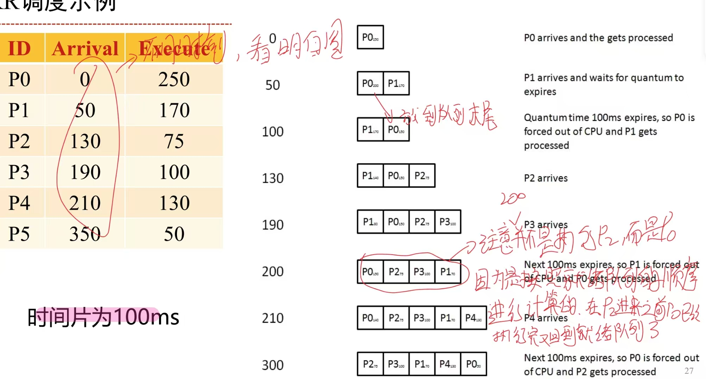
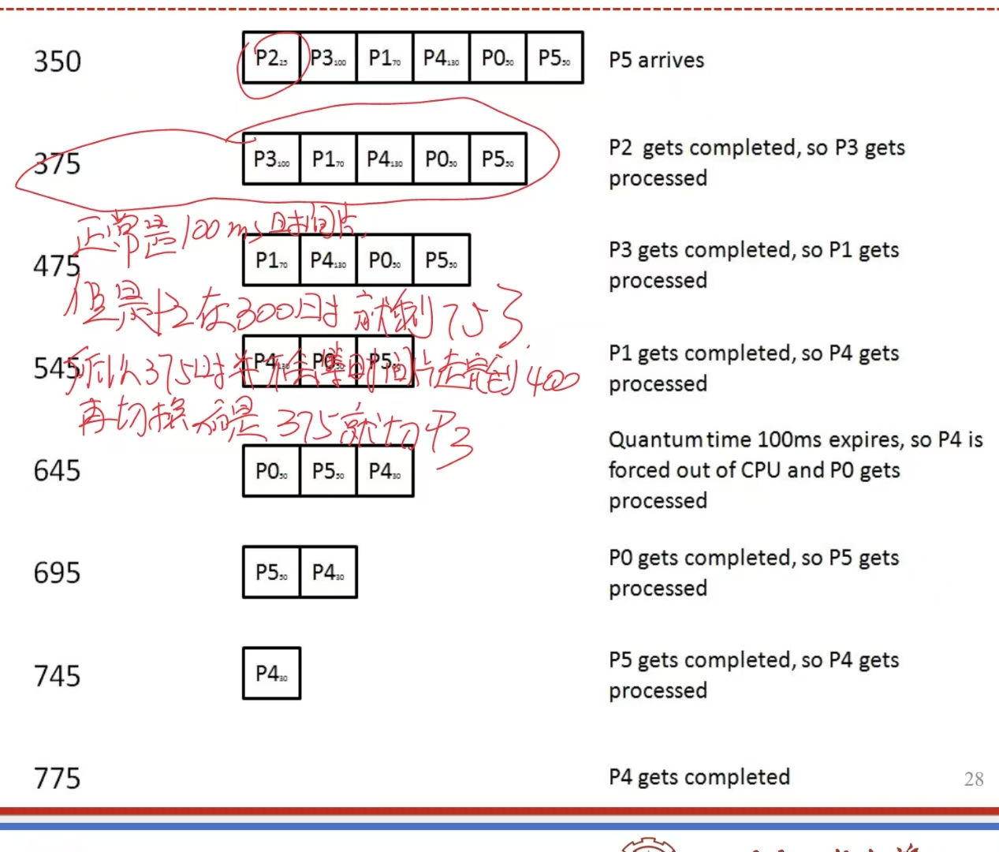
24.多级反馈队列：将任务按照优先级分成多个队列，每次才能够优先级最高的队列中选择任务，只有当优先级最高的队列0为空，才会在执行队列1，以此类推（这样会产生饥饿进程）
25.可以通过任务在队列间移动来解决饥饿进程的问题（使用太多cpu时间的会被放置低优先级最列，在低优先级队列过久的任务会被移动到高优先级队列）。并且不同优先级队列采用的调度算法可以不同（考虑的参数较多）
26.彩票算法：保证每个任务获得一定比例的cpu时间。
27.彩票算法具体做法：假设进程a有75张彩票-应占有75%的cpu时间，假设彩票编码为0-74，进程B有25张彩票-应占有25%的cpu时间，假设彩票编码为75-99。调度进程会产生随机数并且加载中奖进程并运行。比如随机数为66，那么运行进程a；随机数为88，运行进程B

### 王道补充内容
1.调度分为三层
1）**作业调度（高级调度）**：从外存中处于后备队列的作业中挑选一个为其建立进程，并送入就绪队列（从外存到内存）
2）中级调度（内存调度）：a.将不能运行的进程放至外存等待，即挂起态（阻塞挂起，就绪挂起）。当外存上那些挂起进程已经具备运行条件时，中级调度来决定将哪一个挂起进程再导入内存  b.级调度的目的是为了提高内存利用率和系统吞吐量。
3）进程调度（低级调度）：按照某种算法从就绪队列中选取一个进程，将CPU分配给他

3.**注意：如果题目未告诉是哪一种调度，就默认是进程调度；如果题目中明显出现进程调度和作业调度两个字眼时，注意此时就要考虑作业从外存调入内存的作业调度算法和从就绪队列到运行态的进程调度算法两种方式，**
4.非抢占式调度的更全面解释：是指当一个进程正在CPU上执行时，**即使有某个更为重要或紧迫的进程进入就绪队列，仍然让正在执行的进程继续执行，直到该进程运行完成（如正常结束、异常终止）或发生某种事件（如等待/O操作、在进程通信或同步中执行了Block原语）而进入阻塞态时，才将CPU分配给其他进程**。非抢占调度方式的优点是实现简单、系统开销小，适用于早期的批处理系统，但它不能用于分时系统和大多数的实时系统
5.**注意抢占式调度和非抢占式调度只针对进程调度而言，也就是针对从就绪队列到运行态的调度。对于从外存到内存的作业调度，这种调度方式没有抢占式，只有当内存中有作业完成以后，才能有新的作业调入内存。**
6.闲逛进程：当进程切换时，如果系统重没有就绪进程，那么就会调度闲逛进程运行，其pid为0，优先级最低，只要有进程就绪，就会立即让出cpu
7.cpu利用率：cpu有效工作时间/第一个作业开始执行到最后一个作业执行结束的时间
8.带权周转时间：周转时间与运行时间(也就是CPU时间的)比值
9.FCFS调度算法：对长作业（cpu繁忙型作业）有利，对短作业（io繁忙型）不利
10.短作业优先算法SJF的缺点：可能导致出现饥饿进程（长作业长期不被调度）
3.高响应比优先调度算法（可抢占可不抢占）：**选择每次响应比最高的投入运行**具体内容如下图所示：
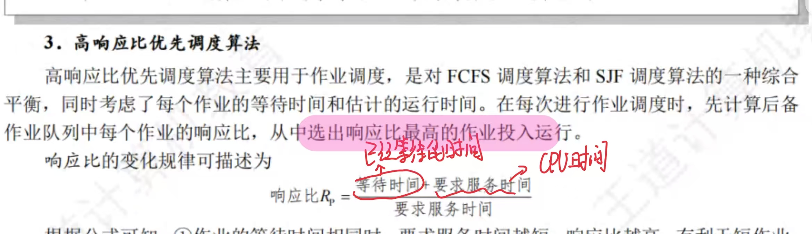
4.从上图内让可以看出：
1）高响应比同时考虑了进程的等待时间和cpu运行时间，综合了FCFS和SJF
2）当作业的等待时间相同时，cpu运行时间越短，响应比越高，有利于短作业，类似于SJF
3）cpu运行时间相同时，等待时间越长，响应比越高，类似于FCFS
4）对于长作业，作业的响应比随着等待时间的增加而提高，当等待时间足够长时，也可获得cpu，避免了饥饿现象

5.优先级调度：
1）默认情况下是按照优先权最高的进程来运行
2）可抢占也可以不抢占
3）可分为动态优先级和静态优先级（动态优先级中优先级会随着进程的推进或等待时间增加而改变）

6.正常情况下优先级的设定有以下原则：
1）系统进程>用户进程（系统进程作为系统的管理者理应拥有更高的优先级）
2）交互性进程（前台）>非交互型进程（后台）
3）i/o行型进程>计算性进程：io设备的处理速度比cpu慢得多，因此若将io型进程的优先级设置得更高，就更有可能让io设备尽早工作，这样可以和cpu并行工作

7.多级反馈队列调度算法：融合了前几种算法的优点（可以兼顾多方面的系统目标，比如兼顾长短作业，有较好的响应时间）
8.几种响应时间的总结如下图所示：
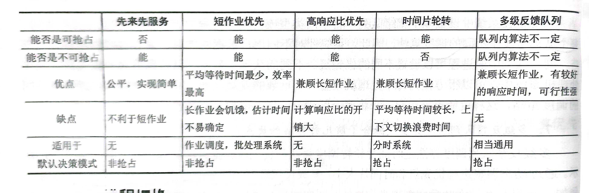
9.处于临界区的进程也可以被调度（临界区的代码就是一些共享的代码段，需要互斥访问，处于临界区的进程就是在执行临界区代码的进程）
10.分时系统：把处理器的运行时间分成很短的时间片，按时间片轮流把处理器分配给各个作业使用
11.实时系统：要求能够及时处理紧急的外部事件，通常采用抢占式优先级调度算法
12.所有调度算法之中：只有时间片轮转算法是绝对可抢占的
13.时间片轮转算法当时间片过大时（认为大于任何一个进程的运行时间时），就会转变为FCFS
14.当使用SJF出现两个进程的预计时间相同时，则这两个进程之间才用FCFS，先调度先进入就绪序列的进程；当使用优先级调度出现两个进程优先级相同时，与上同理才用FCFS
15.所有进程调度算法中，开销最小的调度算法是：FCFS
16.中断处理结束也会引起调度程序调度执行（因为在中断处理是，cpu运行的是中断处理程序，中断处理结束以后需要返回原程序或重新选择其他程序，后者需要进程调度）
17.注意：当问进程调度的总次数时，在0时刻，第一个进程获得cpu也算一次进程调度
4.用户提交和进入就绪队列是不是一个东西？答：不必纠结个边界，只需要知道是减去到达事件即可，所有的题都会告诉一个到达时间这个东西

## 第三章 并发与同步（信号量和信号）
1.临界区：操作共享变量的一些代码段，这些代码段就是共享变量的临界区
2.临界区的代码需要互斥访问（不应该和其他临界区的代码交替执行）
3.信号量：是一个整数值的全局变量，被P(&s)（wait()）和V(&s)（signal()）操作处理
4.**PV操作定义一：对与P操作，首先判断s如果大于0，s--；如果s==0，挂起这个线程，直到有V操作重启这个线程（重启后的线程会重新进行p操作）。对于V操作，首先将s++，if有任何线程阻塞在了p操作等待s变为非0，那么v操作将重启一个线程，使其可以重新p操作。**
5.**PV操作定义二：对于p操作，不进行判断，直接对value--，然后判断如果value<0，将他加入阻塞队列。并将其唤醒对于V操作，首先将value++，然后从阻塞队列中移除一个线程，他就可以从block的地方继续执行下面的语句**
6.**注意：1）对于PV操作的定义中，++操作和--操作都是原子操作，
          2）对于s或value的初始值都设置为1。
          3）对于定义一，s不会为负值最少值为0；对于定义二，value可以为负值，并且这个负数的绝对值就是阻塞的线程数量**
7.**信号量实现互斥的基本思想：用信号量pV操作将相应的临界区包含起来，s初始值为1**
8.**二元信号量**）：值总为0或1的信号量
9.**计数信号量（用于同步）** ：一个被用作一组可用资源的计数器的信号量
10.虽然使用信号量可以来保证互斥，**但是使用信号量会使程序的运行效率大幅降低**
11.进程和线程都可以使用信号量（只是接口不同，上面只是以线程为例子）
12.临界资源：一个仅允许一个进程使用的资源（设备，变量、数据都可以是）
13.互斥：对于某个资源，同时只允许一个访问者对其进行访问，但互斥无法限制访问者对资源的访问顺序，访问是无序的
14.进程之间的制约关系；1.间接制约（竞争）2.直接制约：相互协作，保证先后顺序（同步）
15.同步：在互斥的基础上，通过其他机制实现访问者对资源的有序访问。少数情况下，同步允许多个访问者同时访问资源
15.同步机制应该遵守的准则：
1）空闲让进
2）忙则等待
3）有限等待
4）让权等待（原则上遵循，但并不是必须遵循的）

16.信号与信号量的区别：信号是一种处理一异步时间（比如中断）的方式，而信号量是进程间通信处理同步互斥的机制
17.**信号量实现同步的基本思想：用计数信号量跟踪资源的状态和通知其他线程，用互斥信号量来保护对共享资源的访问。**
18.**经典例子：生产者消费者问题（同步问题）、读者写者问题（互斥问题，写者优先不要求掌握，只掌握读者优先）、哲学家用餐问题（互斥问题）**
19.**基于生产者消费者问题总结出来同步问题的要点：
1）一般需要一个互斥信号量和两个计数信号量，互斥信号量确定共享资源（缓冲区）的互斥访问，计数信号量用于计数可以用资源个数和可以的槽位个数。
2）给互斥信号量初始化为1，计数信号量分别初始化为刚刚开始的共享资源的个数0（最开始有0个项目），和缓冲区可以承载最多的资源n（有n个空槽位）（item代表可用的元素，slot代表可用的槽位）
3）在缓冲区的插入和移除中，计数信号量要将互斥信号量包围；互斥信号量的pv操作要成对用，计数信号量的pv操作是交叉用
4）当交换临界区代码执行之前的互斥信号量和技术信号量的语句时，会发生死锁现象（考虑极端情况），但可以交换临界区代码执行之后的互斥信号量和计数信号量的语句，先释放哪个后释放哪个无所谓**

20.读者写者问题（写者优先）要求：
1）写者必须互斥访问共享对象
2）写者、读者必须互斥访问共享对象
3）多个读者可以同时访问共享对象
4）要求不让写者等待，除非已经把共享对象的使用权给了一个写者
5）一个后来的读者也比写者的优先级要高
21.读者写者问题无论是那者优先，都会导致饥饿现象
22.饥饿现象不等于死锁，饥饿现象是有机会获得资源，死锁是任何机会都没有
23.下面给出读者优先的源代码，细细揣摩源代码，根据下面写出来的要点对代码进行1记忆
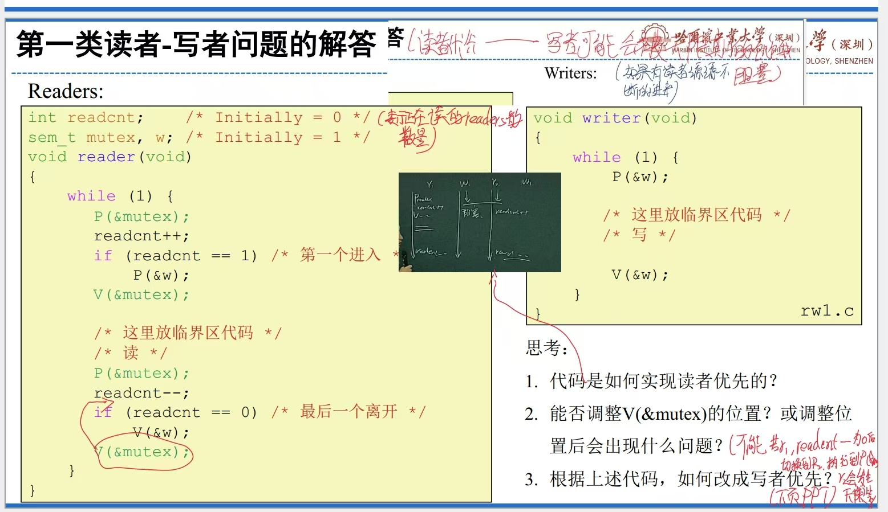
24.要点
1）对于读者写者问题要用到两个互斥信号量，一个是用于进行读者写者、写者写者互斥访问的，一个用于共享变量cnt进行互斥的（因为可以保证多个读者同时读，那么对于读者数量的改变也需要进行互斥）
2）写者只需要用大锁w将临界区代码包起来，而读者还需要将有关readcnt的代码段包起来
3）对于图中第二问，当然不可以调整位置。因为调整位置后，如果当前线程是最后一个读线程，执行到V操作以后在还未执行if判断时，进程调度时另一个读线程获得mutex，那么并且执行完readcnt++需要获得进行w的p操作时，其实此时他如果又调度到第一个线程，readcnt已经变为1，if语句判断为假，不会释放w锁，那么另一个读进程会在p（&W）出被阻塞，后面来的读写进程也会被阻塞导致整个系统形成死锁。

25.哲学家用餐问题：五个人五个筷子围成一桌，饥饿时需要取左右两只筷子才能进餐，用餐完毕后放下筷子继续思考。（那么筷子就是共享资源）
26.哲学家用餐解决方法：至多只允许四位哲学家同时取拿左边筷子，最终能保证至少有一位能够进餐，在用餐完毕后释放掉占用得快，使其他哲学家能够进餐（具体做法就是在原有的互斥信号量chopstick[5]，之外再加一个计数信号量初始化为4，包裹来互斥信号量外面，用于保证同时只能有四个人取拿筷子）
27.四类线程不安全函数：
1）不保护共享变量的函数（改正：用pv操作包含共享变量，但效率变低）
2）保持跨越多个调用的状态的函数（全局变量依赖于跨多个函数的持久状态，就是全局变量被的值被多个函数所改变，多线程调用这些函数情况下会出乱子，fix；将全局变量改为函数传入值来操作）
3）返回指向静态变量的指针的函数
4）调用线程不安全函数的函数

28可重入函数：其被多个函数调用时，不用引入任何共享数据（是线程安全函数的子集）

### 王道补充内容
1.注意：临界区是指的是访问临界资源的代码，**临界区是代码程序**
2.临界资源是一种**互斥共享资源**，可以是很多东西：物理设备、变量、数据等
3.执行程序的前驱关系（谁在谁其那面执行）实际上也是一种同步关系，需要用信号量解决（所有信号量初始化为0，对于同一个信号量，在先执行的代码进行V操作，在后执行的代码进行P操作;对于同一个程序，先进行P操作（检查前驱程序有没有执行完），在进行V操作（告诉后驱程序此程序已经执行完成））
4.PV操作不得被中断
5.互斥信号量只是初值赋值为1，但由于实现方式的不同，不一定是二元信号量，其也可以为负数。
6。临界区是进程中用于实现进程互斥的代码段。这个表述是错的，临界区是访问临界资源，而不是实现进程互斥
7.生产者消费者是解决多个进程之间的同步和互斥问题。
8.五个并发进程就会有5个访问临界资源的代码段，临界区就是访问临界资源的代码段，所以此进程的相关临界区是由5个临界区构成
9.信号量设计题严格按照下图的步骤来做：
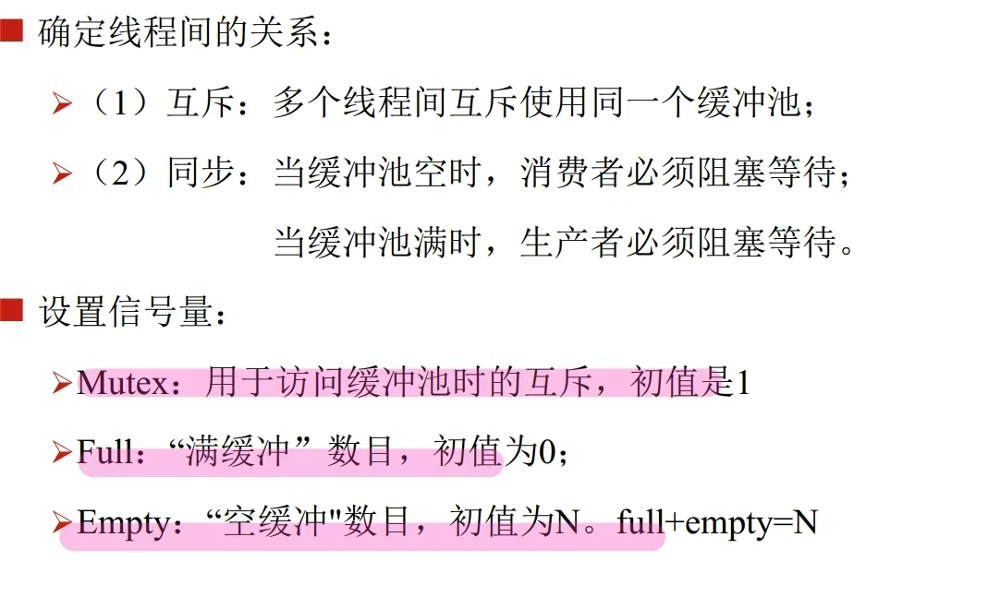
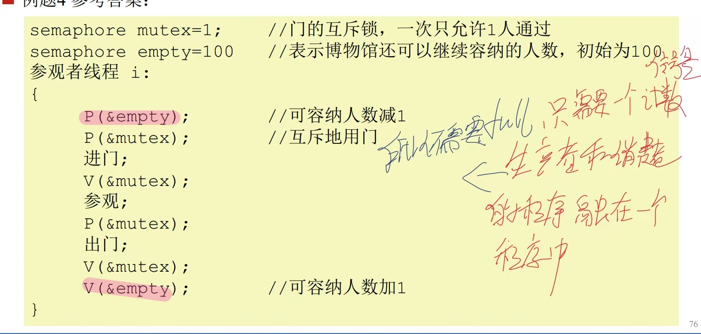
1）第一步：先说明白其中的互斥关系和互斥关系
2）第二步，设置信号量，并且说明每个信号量的用途和初值
3）数学程序，注意信号量变量类型为semaphore

## 第四章 死锁
1.形成死锁的四个必要条件：
1）互斥使用（至少有一个资源互斥使用）
2）不可抢占（不可剥夺）（资源只能自愿放弃）
3）持有和等待（请求和等待）（进程必须持有资源再去申请）
4）循环等待（资源分配图形成一个回路）

2.进程线程都可以形成死锁
3.死锁处理方法：
1）死锁预防（破坏死锁的四个必要条件之一）
2）死锁避免（每次有资源请求使，使用银行家算法判断是否进入不安去状态，但是效率太低o（mn2））
3）死锁检测+恢复（是将银行家算法进行改动，直到出现死锁时在处理）
4）死锁忽略（躺平）

4.死锁预防中破坏每个必要条件的方法以及结果
1）破坏互斥使用：系统固有特性无法破坏
2）破坏不可抢占：剥夺已经保持的资源
3）破坏持有和等待：一次申请所有需要的资源
4）破坏循环等待：资源申请必须有序进行，给资源编号，进程只能按照编号从小到大请求资源

5.银行家算法只是判断当前是否进入到不安全状态
6.银行家算法要点，n个进程，m个资源：
1）available[m]：资源当前可用总量
2）allocation[n][m]:当前分配给各个进程的资源量
3）need[n][m]:各个进程还需要分配的各个资源数量
4）work[m]：代表当前可分配的资源，包括可收回的

7.银行家算法运行过程：
1）初始化work=available
2）从p0开始循环查找，如果need[i]<work,那么此进程能够完成，执行此进程并且work+=available[i][m]，
3)循环第二步一直查找

8.真正的死锁避免，是每次出现一个请求资源request[i][m],就使用银行家算法判断在如果在接受这个请求以后，是否处于不安全状态。
具体使用银行家算法时，先要假设接受这个请求，available[m]-request[m],need[i][m]-request[m],allocation[i][m]+request[m],之后再进行银行家算法
9.死锁检测+恢复：只要可用足够就分配，就是将银行家算法源代码中的need[]换成了request。并且对于allocation[i]都为0的进程，直接默认已经完成。
10.对于死锁恢复：终止所有进程或者进程回滚，代价都非常大
11.死锁忽略：使用鸵鸟算法（不做任何处理）
12.银行家算法的系统中资源总量为，allocation矩阵和available数组相加得到
13.**注意：存在不安全序列（系统进入不安全状态）不代表进入了死锁状态，只有当新的进程提出资源申请后，所有进程都进入阻塞态，系统才处于死锁状态**

## 第六章 内存管理
1.重定位最合适的实际是在运行时重定位（动态重定位）
2.将用户源程序变为可在内存中执行的程序，需要**编译、链接和载入**三个步骤
3.实际应用中逻辑地址、虚拟地址线性地址不加区分，统称为逻辑地址或者虚拟地址
4.MMU是将逻辑地址转化为物理地址的**CPU中的硬件**
5.嵌入式操作系统的虚拟地址等于物理地址（链接时重定位）
6.现代操作系统的虚拟地址不等于物理地址（运行时重定位）
7.连续内存分配管理的概述
1）固定分区——等长分区（程序太小造成浪费，程序太大无法装入）
2）固定分区——变长分区（小分区不能满足大进程）
3）可变分区：根据reqsize动态分割（需要空闲分区表和已分配分区表来维护内存）
可变分区的分区分配算法（找到合适的分区）
a.首次适配：从前往后遍历空闲分区表，找到**首个满足**要求的空闲分区（优点：快速）
b.最佳适配：查找到**最小的满足**要求的空闲分区（回搜索整个空想分区表，慢；回产生许多小的空闲分区）
c.最差适配：查找到**最大的满足**要求的空闲分区（回搜索整个空想分区表，慢；新产生的空闲分区会大一点）

8.外部碎片（**针对可变分区**）：内存中产生许多特别小的分区，并不连续可用
9.内部碎片（**针对固定分区**）：每个分区中会并未占用的空间不能分给其他进程
10.碎片问题可以通过**内存紧缩来消除**，但是时间成本极高（以对1gb的内存秒为单位才能做完）
11.分段：将程序分段装入内存（比如按照code、data、stack和heap）。那么对于一个进程来说，就需要建立段表来保存这几个段的基址和长度
12.进程段表会存储在PCB中，页表也存在PCB中。
13.分段机制依然存在内存分区表和内存分配算法
14.分段机制中，ppt中例子，逻辑地址总共16位，前两位为段号，后面14位为段内偏移，当给出一个逻辑地址时，以0x4050为例，只需要讲4写成二进制，前两位是段号，后面的都是段内偏移，后面的12位就不用二进制展开了
15.**分段技术优点：**符合程序员的习惯;缺点：空间预留会形成内部碎片，空闲空间很大却不能分配（外部碎片）
16。分页机制没有外部碎片，只有内部碎片
17.分页机制中页表项过多页表很大采用多级页表来解决，多级页表地址翻译的效率过低采用TLB来解决
18.多级页表中，顶层页表要常驻内存，一级页表（页目录）存放的是二级页表的首地址
二级页表中存放的是真正的物理页的首地址
19.TLB也是硬件，一组寄存器
20.**分页机制优点**：不符合程序员的习惯，但靠近硬件，更适合硬件实现
21.段页结合技术是把段式和页式的缺点和优点的加和
22.实模式无分页机制，只有分段机制，保护模式分页分段机制都有。

### 王道补充内容
1.在多级页表中，越靠近物理地址的页表的级数越高，cpu页表寄存器存的是一级页表的物理地址
2.注意给出看清楚页内品偏移量的位数，0-11代表12，,-10位代表11位
3.首次适配的空闲分区按照初始地址递增链接；最佳适配按照空闲区间递增链接，最差适配按照空闲区间递减链接
4.分页的目的是离散分配并提高内存利用率
5.在地址转换时注意是十六进制还是十进制

## 第七章虚拟内存
1.内存置换算法（磁盘到内存）：
1）先进先出页面置换（FIFO）
2）最佳页面置换（optimal replacement OPT）
3）最近最少使用页面置换（LRU）：

2.**先进先出页面置换：淘汰最早调入的页面**
3.**最优页面置换：淘汰未来最远使用的页（缺页次数最小）**
4.**最近最少页面置换LRU：选最近最长时间未使用的页**
5.**注意：前几个按需请求的页数也算缺页次数**
6.LRU有两种**精确实现**的方法：1）计数器法 2）页码栈法
7.LRU计数器法使用规则：
1）设置一个时钟（计数器）寄存器，每次只要有页引用，计数器就加1，并将加1后的值复制到相应表项中
2）需要换页时，选择计数值最小的页
3）缺点：需要维护一个全局时钟（可能溢出），并且换页时需要多次比较找最小值，代价较大

8.页码栈法使用规则：
1）建立一个容量为内存分配页面数量的页码站，每当引用一个页时，该页号从栈中上升到栈顶部，
2）当需要置换页时，直接置换栈底页即可，并且新换入的页在栈顶
3）缺点：每次地址访问都需要修改栈，实现代价较大

9.LRU准确实现用的较少
10.LRU的近似实现：1）时钟法 2）引用位法
11.LRU始时钟法（CLOCK算法）具体做法：
1）每当访问一页时，如果存在页命中，则访问位置1，**查询指针不动**
2）如果不存在页命中，循环检查各个页面的情况：如果是0，淘汰该页；如果是1，复位位0
3）当某页时初始分配或者页被替换，新进入的页要置1，则指针指向下一页

12.CLOCK算法最差会退化为FIFO
13.CLOCK算法的改进：
1）设置一个快的扫描指针指针用于用于定时清除R位，清楚的速度不定，与空闲内存比率呈反比例
2）除了访问位A，再多设置一个修改位M，认为修改了的也经常使用，具体就是第一轮找00，第二轮找121，并且将A位置0.
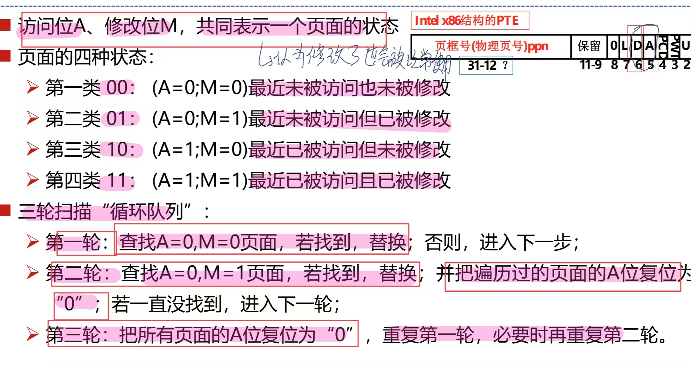

14.写时复制：为了更快创建进程，**子进程共享父进程地址空间**，直到某个进程要写某些页时，才复制产生一个新页
15.工作集：给进程分配的主存地址空间（动态变化）
16.分配的页数过少，页错误率相对较高；分配过大，由于局部性原理，页错误率没有明显的影响
17.工作集分配方式：固定分配（大小固定），动态分配（大小可变，根据缺页率调整）
18.两种页面置换策略：局部置换（只能淘汰自己进程的页），全局置换（可以淘汰别的进程的页
19.颠簸（CPU抖动）：进程调入一页，又马上将这页淘汰出去，刚淘汰出的页又马上进行替换（基于也错误率和工作集分配相互配合解决）
20.Belady异常：有的置换算法，页错误率可能会随着分配页数增加而增加
21.**LRU和OPT没有Belady异常，FIFO有BElady异常**

## 第八章
1.IO控制方式
1）程序直接查询方式
2）中断控制方式
3）直接内存存取方式（DMA）
4）通道控制方式

2.缓冲技术分为：硬件缓冲和软件缓冲
3.软件缓冲的四个方式
1）单缓冲
2）双缓冲（一定程度上实现并行交换数据）
3）环形缓冲
4）缓冲池（所有进程可以共享）

3.spool（假脱机操作）：将独占设备改为共享设备的技术

下面是磁盘调度算法，刻画指标为移动的磁道数
4.先来先服务磁盘调度（FCFS）：按照请求的顺序调度
5.最短寻道时间优先（SSTF）：距离最近的请求优先，存在饥饿问题
6.扫描（电梯）调度算法（SCAN）：SSTF+中途不回折，一定先往最左到0，再往回折，解决饥饿问题
7.循环扫描调度算法（CSCAN）：SSTF+直接移动到另一端，即向左到0，直接回位到199.
8.CLOOK磁盘调度：CSCAN+向前看一看，前面没有就回移
