## 第一章
1.数据库的三种语言：  
 1）DDL：定义表的标题、名称和属性的范围等  
 2）DML：增删改查
 3）DCL：加权限，安全性。

2.管理数据的三个层次：
  1）用户层（外部层）
  2）逻辑层（概念层）
 3）物理层（内部层）

3.三级模式（三级视图）：外模式（视图）、概念模式（模式）、内模式
4.两层映像：E-c Mapping，C-I Mapping
5.两个独立性：逻辑数据独立性，物理数据独立性
6.数据与数据的结构：模式；
    模式与模式的结构：数据模型
7.三个数据模型：层次模型（树）、网状模型（图）和关系模型（表）。

## 第二章——代数表达式
1.关系的三个特性：列是同质的，行列位置无关性，属性不可再分特性
2.关系中可能有多个候选码，但主码只有一个
3.主属性是任何一个候选码的属性都是主属性
4.候选码和主码具有极小性，主码具有唯一性
5.关系的三个完整性约束：实体完整性，参照完整性，用户自定义完整性
6.实体完整性和参照完整性由DBMS自动支持
7.关系代数五大基本运算：并、差、积、选择，投影
8.并相容性（并交差运算需要满足）：
 1）两个表属性个数相同
 2）每个域都相同
9.关系和表的区别：关系不能有相同的元祖，表可以有相同的元组
10.**投影操作会自动去重**
11.自然连接要点
 1）必须要有相同的属性组
 2）并且值相同才能连接（有多少个相同的属性组，就得要有多少个属性组值都相同的才能连在一起）
 3）去掉相同的属性列
12.θ链接是选择笛卡尔积中，符合θ条件的元组构成。

#### 代数表达式典型例题和做法
1）自身表连接（至少什么和什么），比如至少学号为101号同学和102号同学学过的所有课程号，并且要注意更名。
2）不学习.....，这种的用所有的减去学习的即可。
3）看到“全部”要用除法，比如查找选修了全部课程的学生学号，被除的就是SC，除数就是全部课程
4）看到所有....的消息，使用外连接，需要谁的全部信息就把等号加到哪里。
5）看到全部要用除法。比如：找出选修了全部课程的学生学号；
   另一种表述也要用除法：选修课程包含谁谁谁所选课程的学生学号
	做法：首先找到全部课程，然后找到课程和学号都有的表学生选课SC，进行相除
6）自身表连接的变式：至少选修两门课程的学生学号。只需要在选择的时候从且变成二者不等于即可。由于投影可以自动去重，所以直接投影即可。
7）选修了程军老师所授课程的学生学号与选修了包含程军老师所受课程之一的学生学号两个表述一样。因为投影会自动去重。

典型例题如下图所示：
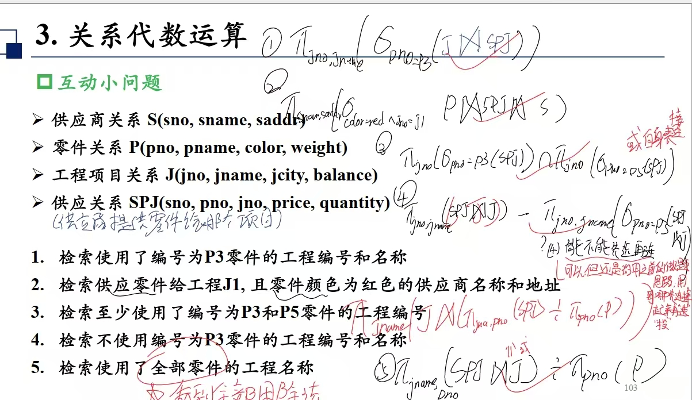

## 第三章——sql语言（包括索引，第七章ppt）
1.不同语言的引导词
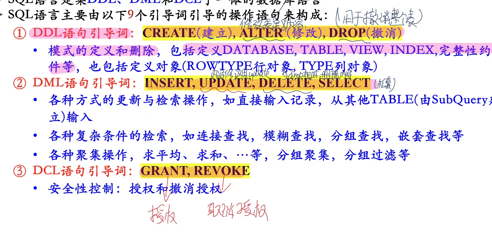
2.模糊查询
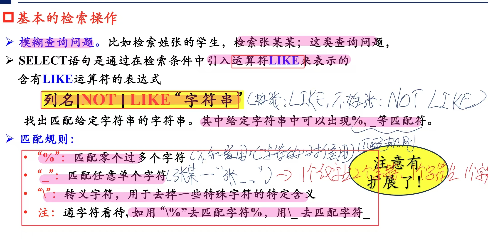
3.多表联合检索时，**检索条件中要包含连接条件，就算是自然连接也要写连接条件**
4.子查询类型：in/not in、θ(关系运算符) some/all、exists（后面跟的是*并且一定是相关子查询）
5.非相关子查询和相关子查询的区别：处理次数不同、依赖不同、效率不同
6.=some和in起到的效果是一样的，但是not in和不等于some的效果是不一样的。
7.not in和不等于<> all是等效的
8.双重否定，具体看下面的例子
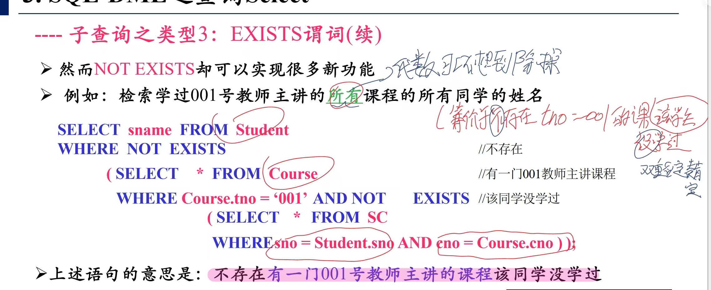
9.聚集函数都有count（输出元组的总数）、sum（求和）、avg、max和min
10.如果空值参与聚集运算，除了count外其他的都忽略null
11.删除sql语句：delete from sth where
12.更新sql语句：update sth set sth where
13：所有sal查询题型题型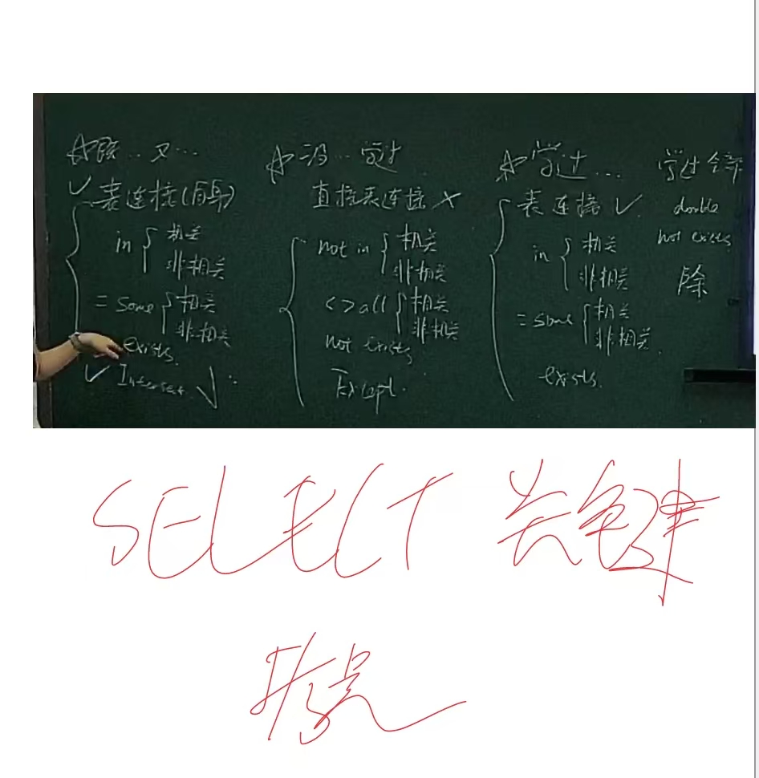
14.创建视图的sql语句：create view viewname as（子查询）
15.视图的更新：如果视图是从**单个基本表进行选择、投影导出的，并且包含了基本表的主键**，那么可以对视图进行更新，基本表也会跟着更新，其他情况均不可以

## 第四章
1.完整性约束按照约束对象分类可分为：域完整性约束条件，关系完整性约束条件
2.按约束来源可分为：结构约束、内容约束
3.按约束状态可分为：静态约束，动态约束（触发器）
4.create table三种功能:
1）定义关系模式、
2）定义完整性约束、
3）定义物理存储地址
## 第六章——函数依赖、范式、分解理论
1.部分函数依赖和传递函数依赖存在非受控冗余
2.快速求候选码的方法：
  1）如果属性只出现在函数依赖的左部或者其==从未出现==在函数依赖中，那么必定出现在任一候选码中。
  2）如果只出现在函数依赖右侧，那么不可能是候选码
  3）如果函数依赖左侧和右侧都会出现，不一定能够。
  4）通过以上三条确定目前肯定是候选码的之后，求这些属性的属性集闭包看是否等于U，如果等于就为候选码
  5）如果不等于，那么再与两边都有出现的属性一一组合，来求候选码

3.属性集闭包与函数依赖闭包（区分）的区分：闭包指的是 F逻辑蕴含的所有函数依赖集合（显性+隐形），该集合包含的元素是函数依赖。 属性集闭包是 X属性(集) 关于 F 的属性(集)闭包，该集合包含的元素是属性。
4.求最小覆盖的方法：
1）保持函数依赖右部为单一属性
2）删除冗余函数依赖
3）删除函数依赖左部的冗余属性（用删除掉冗余属性的函数依赖的左部，再没有删除的F中进行属性集闭包计算，看是否包含的右部）

5.求属性集闭包的方法，以（X）+为例子
	1）首先初始化为X中的属性
	2）在F中找左部是X中属性一部分的函数依赖，将其右部加入X，不断迭代得到最后的X就是（X）+
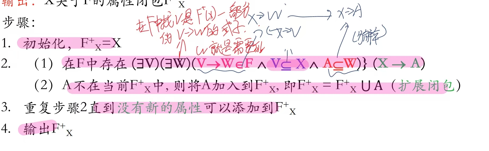
6.最小覆盖消除了部分函数依赖，并未消除传递函数依赖。

1. 1）第一范式（1NF）：不存在多值属性和复合属性
   2）第二范式（2NF）：在1NF的基础上，不存在非主属性对候选键的部分依赖，即非主属性完全依赖于候选键
   3）第三范式（3NF）：在2NF的基础上，不存在非主属性对候选键的传递依赖。
   4）boyce——codd范式（BCNF）：在3NF的基础上，不存在主属性对候选键的部分和传递函数依赖
注意：2NF和3NF都是针对非主属性，而BCNF是针对主属性
8.结论：如果一个函数依赖集F中的任何一个函数依赖X—>Y,X都是此关系的超键，那么此关系R一定是BCNF。
9.问满足BCNF范式的又满足什么，一定要答3NF、2NF、1NF，而不能只答3NF
10.如何从1NF转为3NF的方法（同时满足无损链接性和保持依赖性）：
    1）1NF->2NF：每个被部分依赖的主属性作为主键单独建一个表，然后总表中只保留候选键和完全函数依赖候选键的属性。
    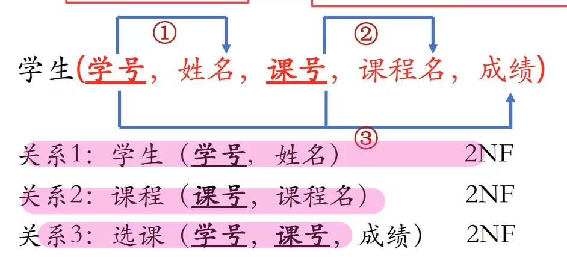
    2）2NF->3NF:把传递函数依赖中的传递者，也就是中间非主属性作为主键单独建表
    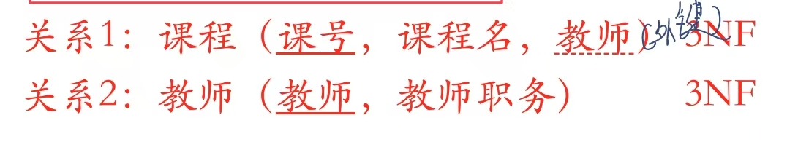
11.无损连接分解：通俗讲就是分解后的每个关系做自然连接之后得到的结果与分解前一样。
12.如何判断是无损连接分解
    1）分解成两个如何判断（注意是或，并且结果要用大括号括起来）
    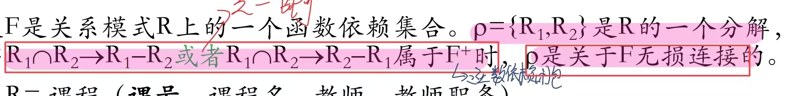
    2）分解成多个如何判断
    第一种判断这些关系做自然连接，连接的是不是候选键（只要是其中一个关系的候选键即可），因为候选键必定能做到一一对应，所以不会有额外信息的生成。
    大题就按照下面的方式进行判断。
   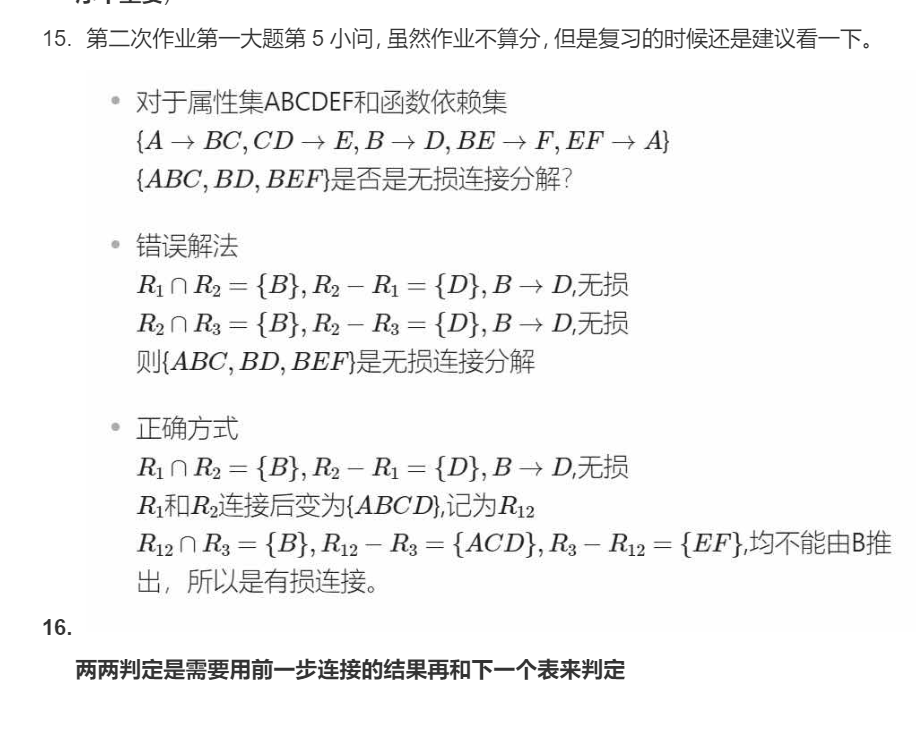

13.如何进行无损连接分解成BCNF的方法（本算法不能保证保持依赖）
    1）寻找现在关系的候选码
    2）如果此时S并不是BCNF，那么必会有X->A，中的X不是超键，此时将（X，A）作为一个关系分割出，这个关系肯定符合BCNF。然后剩下为s2（S-A）。
    3）重复步骤1和2，直到全部关系模式达到BCNF。
注意：在做这种题的时候，要注意传递函数依赖。以下面的这个题为例子，删除C，
    1）那么就要找C在函数依赖左边的式子，然后再找C在函数依赖右边的式子，进行传递。
    2）还有可能会对C有关的式子进行**增广律**之后再开始寻找
    3）在求得过程中，如果得到平凡的函数依赖，就舍弃不要
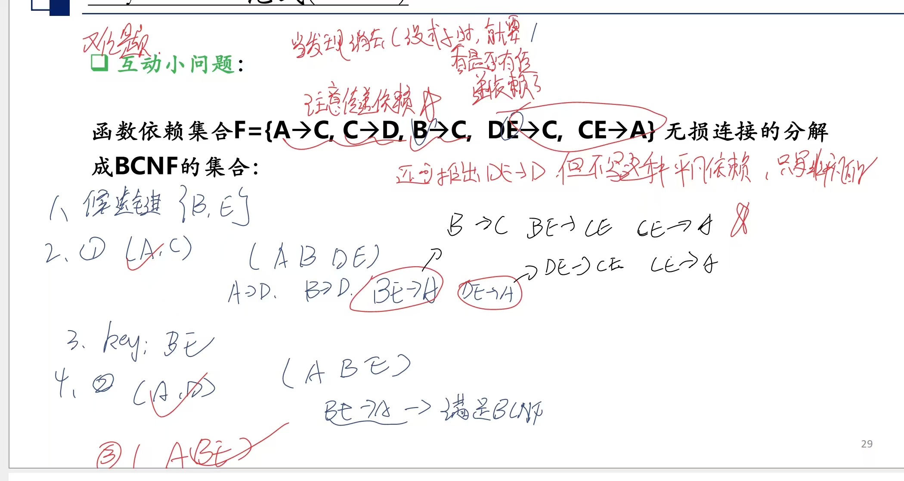

14.保持依赖分解（同样也是判断方法）：分解之后每个关系的所有依赖的并集能够逻辑蕴含F中的每个依赖，那么就是保持依赖分解
15.保持依赖分解和无损连接分解并没有任何关系。保持依赖的分解可能不是无损连接的分解，反之同理。
16.如何进行保持依赖分解成3NF的方法（不一定达到BCNF，但是分解出的结果即是无损连接，又是函数依赖）
    1）首先F得是函数依赖的最小覆盖，如果并没有告诉是最小覆盖，还需要先求最小覆盖、
    2）**把R中不出现在F的属性去掉单独组成一个模式**（容易忘记）
    3）把F中具有相同左部的函数依赖的右端进行合并，然后对于每一个左端相同的函数依赖，建立一个单独的关系

17.注意点：
    1）对范式进行无损连接和保持依赖的分解，能够达到3NF，但是达不到BCNF
    2）对范式进行无损连接能够达到BCNF，但是不保证保持依赖
    3）所以模式分解可以做到即保持依赖，又保持无损连接，但是只能最多达到3NF，不一定能到BCNF

## 第七章——数据库索引
1.索引项：由两部分组成：索引字段和行指针
2.稠密索引：索引文件中包含了主文件对应字段的**所有**不同值
3.稀疏索引：索引文件中包含了主文件对应字段的**部分**不同值
4.稀疏索引的使用要求：主文件必须是按照对应索引字段属性排序存储
5.主索引：通常建立在主文件基于主码的排序字段上，每个索引项对应一个数据块，是**稀疏索引**
6.辅助索引：建立在主文件非排序字段上。是**稠密索引**
7.稠密索引的检索效率要比稀疏索引的检索效率高。（所以辅助索引检索效率比主索引高）
8.辅助索引不能够建立在主码上，但能够建立在候选码上（候选码有多个）
9.主索引与辅助索引的区别：
1）一个主文件只能有一个主索引，但能有多个辅助索引
2）主索引通常建立在主码上，辅助索引通常建立在其他属性上
3）可以利用主索引重新组织主文件，但辅助索引不能改变主文件数据
4）主索引是稀疏索引，辅助索引是稠密索引。

10.聚簇索引：索引中邻近的记录在主文件中也是邻近存储的（主文件一定有序，索引中没有重复值），反之就是非聚簇索引
11.主索引是聚簇索引。
12.主索引与聚簇索引的区别：
1）主索引一般建立在主码上，聚簇索引建立在主码或非主码上都可以
2）主索引是稀疏索引，聚簇索引是可稀疏可稠密

13.B树索引：每个数据块例n个指针，索引字段n-1，所以索引项为n-1
14：==叶子结点的最后一个指针始终指向下一个数据块，指向主文件的指针也不要忘记加，这两个很重要一定都要画==
15：B+树与B树索引的区别：
1）同样大小的数据块，B树存放的索引项个数要比B+树少，因为B树的非叶节点比B+树多了指向主文件的指针。
2）B+树的索引字段值重复出现在非叶节点或叶子节点，而B树的索引字段值不会重复出现
3）B+树指向主文件的指针只出现在叶子结点，而B树出现在叶子节点和非叶子结点。

16.B树与B+树相比，B树查询的I/0次数更多，因为B的非叶子结点的索引项更少，同样的索引项数目，B树更高，增大查询的I/O次数,
17.B+树更适合区间（范围）查找，因为B+树的叶子结点形成的完整的有序列表，更适合区间查找
18.B+树分裂合并的基本原则：
1）根节点：至少两个指针
2）非叶节点：指针数大于等于n/2向上取整
3）叶节点：索引字段数大于等于n-1/2向上取整
19.注意：B+树根节点的键值为其右侧指针的第一个叶结点的键值

20.B+树结点的分裂：
1）当往叶子结点插入需要分裂时，将分裂得到的右侧新节点的第一个值（拷贝一份）向上传到到父亲节点。
2）如果父亲节点还要分裂时，也就是非叶节点要分裂时，此时也将分裂得到的其中一个新节点的第一个值向上传到到父亲节点，但此时不是拷贝一份，而是直接移到上一层去，以此类推。

21.B+树键值的删除：
1）第一种正常删除，并且保证每个根节点键值等于右边指针的第一个叶节点键值
2）当删除后此结点里的索引字段不够时，向左侧去寄借一个过来，然后保证每个根节点键值等于右边指针的第一个叶节点键值
3）当像左借不够借时，合并两个节点，保证每个根节点键值等于右边指针的第一个叶节点键值。如果此时父亲节点指针数不符合基本原则时，从兄弟节点直接借一个结点过来，然后调节各个键值，保证每个根节点键值等于右边指针的第一个叶节点键值

22.动态散列索引包括：可扩展散列索引、线性散列索引
23.可扩展散列桶满一定意味分裂，但不意味着i增加
24.可扩展散列若桶已经满，只重新散列该块的数据到两个块中，其他的不变。
25.可扩展散列的只要每次i一增加，桶就翻倍
26.线性散列索引每次增加1一桶，可能会有溢出快
27.线性散列索引每次插入后都要检查是否满足比例，大于比例就要分裂
28，可扩展散列与线性散列的异同：
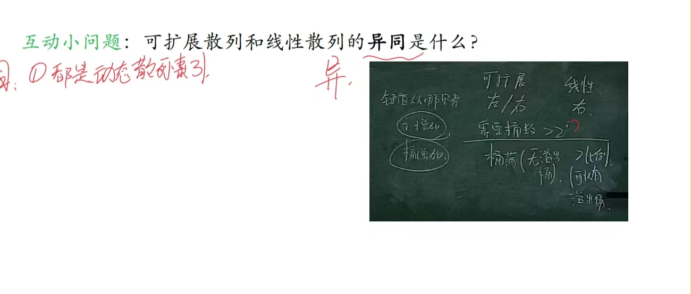

## 第八章--存储管理
1.磁盘由两部分组成：磁盘组件和磁头组件
2.磁头包括：磁臂和磁头
3.磁盘包括：扇区，磁道，柱面
3.扇区是磁盘读写的最小单位
4.磁盘块是系统可以识别的最小单位
5.最常见的页面布局方案为分槽页面
5.磁盘上的文件管理页面方式主要有以下三种：
1）堆文件组织（无序）
2）顺序/排序组织
3）哈希文件组织
堆文件存文件块，取文件慢，；顺序文件组织存文件慢，取文件块
6.表示堆文件组织的两种方式：链表法和页目录法
缓冲区管理器为每个页框维护的两个变量为：pin_count和dirty位
页面置换策略包括:最近最少使用置换策略（LRU）和时钟替换策略

## 第九章--查询处理
1.逻辑层优化是指将投影之类的操作放到链接前面取走
2.物理层优化是根据当前内存中磁盘的多少，取对每一个算法进行优化（并、差等）
3.磁盘是以磁盘块的操作单位，关系首先要被装在到内存，再进行元组的处理。（I/O操作）
4.参数说明：
1）TR（tuple）：关系R的元组的数量
2）BR（block）：关系R的磁盘块数量
3）M为储存缓冲区的页数
4）V（R，a）：a属性在R中不同值的个数

5.不同情况下连接操作物理算法的代价估算（也就是I/O次数）
1）基本实现算法：只有三个内存页可以使用（一页装入R，一页装入S，一页用来输出）：BR+BR*BS
2）大主存实现算法和半主存实现算法：内存完整够装载两个关系或者足够装载一个关系：（BR+BS）
3）大关系实现算法：任何情况下（将关系S划分为BS/(m-2)个子集合，读入M-2快BS，一块装入R，一块用来输出）：BR*（BS/（m-2））+BS

6.查询实现的两种策略：物化计算策略（每次计算一步并保留中间结果，扫描多遍）和流水线计算策略（一次一个元组的操作）
7.基于索引的选择算法的代价估算：如下图所示这是重点要理解
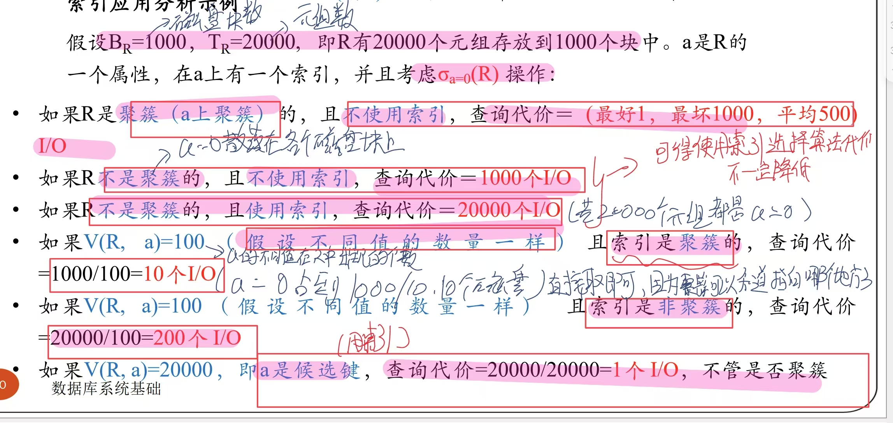
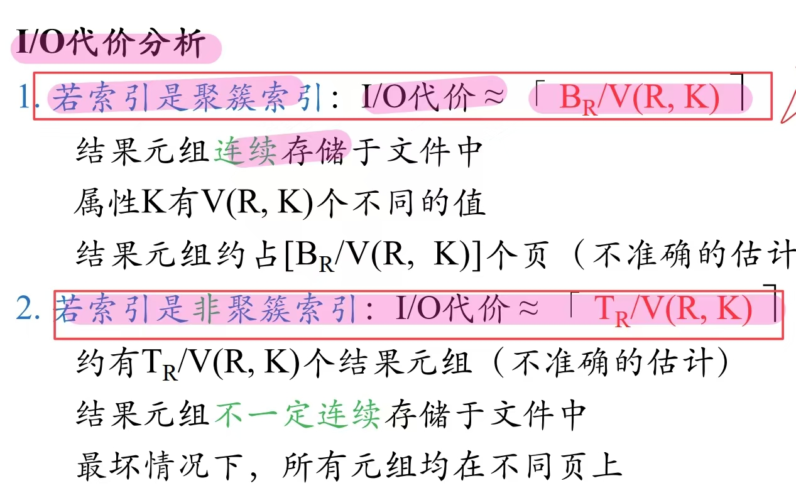
8.由第一张图可以得使用索引选择，代价不一定降低
9.如果使用索引进行选择算法的话，索引是聚簇索引，就用BR除以V（R，a）;如果是非聚簇索引，就用TR除以V（R，a）
10.（**考试必考**）多阶段多路归并算法：适用于M*M\<BR的情况，此种情况下没办法进行两阶段归并就达到目标。
并且如果考虑磁盘读写次数最少的具体算法：
1）**归并段（归并路数）最多为M-1，至少要有一个留给输出**,
2）**分组方式为：使每个子集合块数等于M（尽量把内存占满），除不尽的就余下来**
3）**刚刚开始归并的时候尽量选读写次数最少的，就是选左下角的，因为除不尽的值在左下角，这样可以让其在此阶段的I/O次数最小，并且选取的归并路数能够使下一个阶段选满M-1路进行尽量多的子集归并**
例子如下：
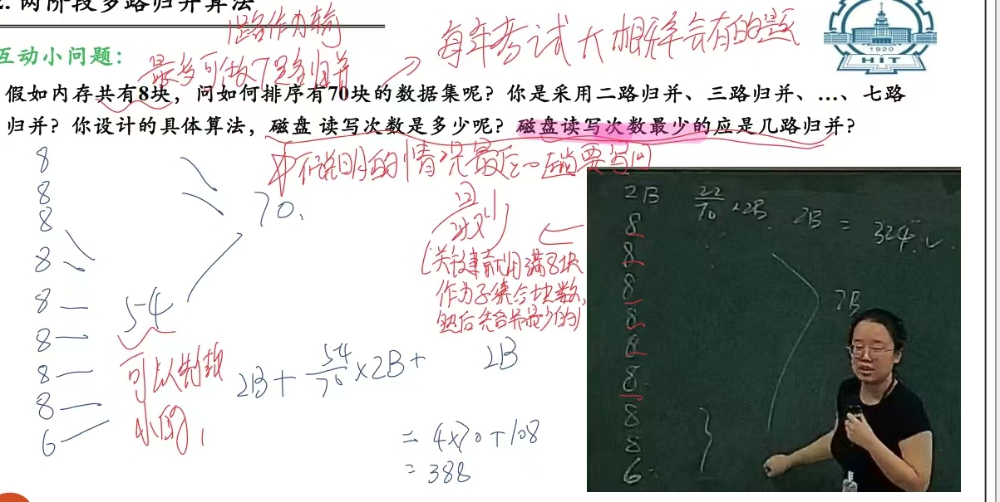
标准例子如下：
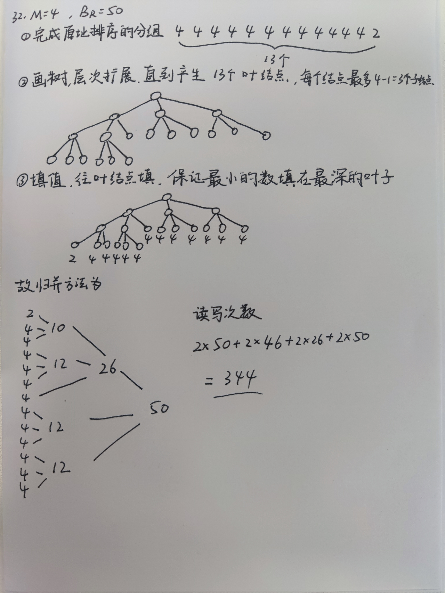

## 第十章——查询优化
1.查询优化的三个优化层面
1）语义优化
2）逻辑查询优化
3）物理查询优化

2.逻辑查询优化基本思想：尽可能早的做选择和投影运算
3.逻辑查询优化，画优化后的语法树步骤如：
1）选择操作中如果有合并的旧将其拆成两个
2）对选择进行下移
3）对投影进行下移
有一些需要注意的地方：
1）投影操作是加上选择中的属性然后拷贝不是把他直接放下去
2）如果投影操作有S#进行下移且选择操作里面有两个S#的话，就将其直接拆分成两个，具体是下面图片的例子，懂得那个意思就好
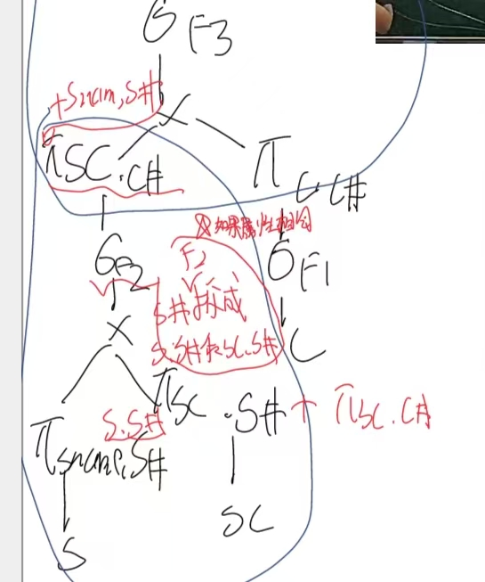
4.用索引不一定比表空间扫描法效率要高
5.
1）投影的代价估算：具体如下图所示：
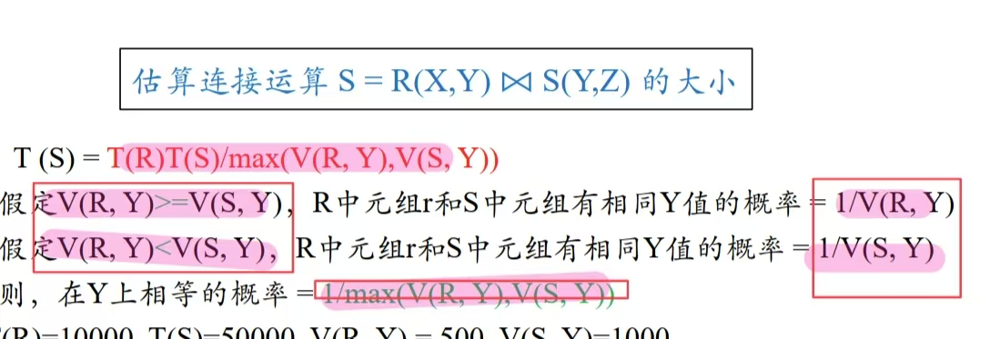
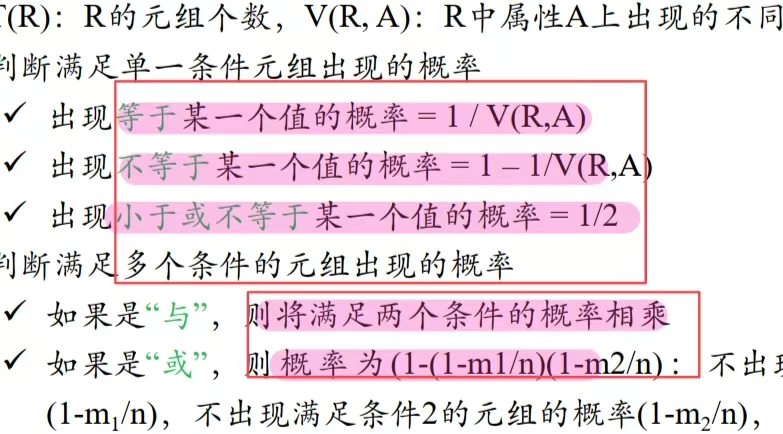

## 第十一章 事务及并发控制
1.如果不进行并发控制会发生的三种不一致现象以及对应场景：
1）丢失修改——买票买重了
2）不能重复读——购物车价格变了
3）脏读——在读之后有用户退货了库存变为已经读的+1了

2.事务：事务是一条或多条的sql语句的一次执行，需要注意的是，事务有开始和结束，而事务结束前必须选择提交（commit）或撤销（rollback)
3.事物的特性：ACID
1）原子性（atomicity）
2）一致性（consistency）
3）隔离性（isolation）
4）持久性（durability）

4.并发调度的正确性：在**这个并发调度**下所得到的新数据库结果与分别串行地运行这些食物所得到的新数据库完全一致
5.并发调度的可串行性：**不管数据库的初态如何**，一个调度对数据库状态的影响都与某个串行调度相同
6.并发调度的可串行性比正确性更严格
7.冲突有读写冲突（**不同事务**对**同一元素**的一读一写或一写一读），写写冲突（不同事务对**同一元素**的两个写操作）
8.冲突可串行性以及**其判断**：一个调度，如果通过**交换相邻两个无冲突的操作**能够转换到某一个串行地调度，那么就是冲突可串行性的。
9.**满足冲突可串行性，一定满足可串行性，一定是正确的**,反之不对。
10.不是冲突可串行性的调度，不一定不是正确的调度。
11.**冲突可串行性判别算法（重点）**：
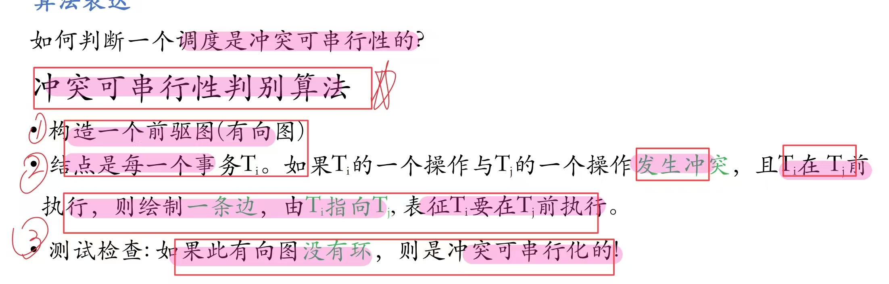
12.总结上面的判断是否满足冲突可串行性的方法
1）交换相邻无冲突的操作
2）找冲突（无需是非要相邻）画有向图，看是否有环

13.**锁本身不能保证冲突可串行性，还需要不同的协议**
14.锁的类型：
1）排他锁X（写锁）：获得锁的可以读也可以写
2）共享锁S（读锁）：获得锁的只能读，但不能写
14.相容性矩阵（排他锁排斥其他所有锁）
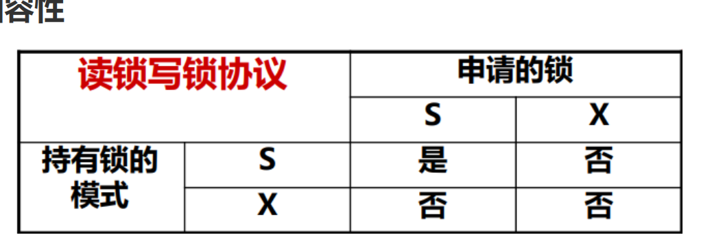
15.一级协议
1）**有写要求的事务需加X排他锁，并且整个事务提交或者roll back才能解锁。有读要求的事务不需要加锁什么时候读都行。**
**2）防止丢失修改**
事务T1修改A值后，获取X锁，在T1结束时才解锁，故事务T2不能在T1结束前再次修改A值。
3）**存在的问题：脏读、重复读**
事务T1修改A值后，事务T2可以在T1结束前读取A值，如果T1结束时选择roll back，则发生了脏读；事务T1读取A值后，事务T2可以在T1结束前修改A值，T1会在结束前读取到不同的A值，所以发生了不可重复读错误。

16.二级协议
1）**有写要求的事务需加X锁，并且整个事务提交才能解锁。
有读要求的事务需加S锁，读操作完成后即可解锁。**
2）**解决了脏读和丢失修改的问题：**
事务T1修改A值后，事务T2如果想进行读操作需要获取S锁，但因为T1加了X锁T2无法在T1结束前获取S锁，所以无法读取A值，因此避免了脏读。
3）**存在的问题：不可重复读**
事务T2先读取一次A值，读取之后S锁解锁，之后事务T1修改了A值，等到事务T1结束后，T2又可以读取修改后的A值，故T2可能读取到一个数据的不同值，发生了不可重复读错误

17.三级协议
1）**有写要求的事务需加X锁，并且整个事务结束才能解锁。
有读要求的事务需加S锁，并且整个事务结束才能解锁。**
2）**解决了不可重复读的问题**：
事务T2读取一次A值，并获得一个S锁，直到T2结束才解锁。事务T1在T2结束前不能获取X锁，故不可以修改A值，所以不会发生不可重复读的问题。

18.两段封锁协议是一个基于锁的并发控制的方法，**要求所有封锁请求先于任何一个解锁请求，即加锁段中不能有解锁操作，解锁段不能有加锁操作**
19.两段封锁协议可以保证冲突可串行性，但是可能产生死锁
20.基于时间戳的并发控制方法可以保证冲突可串行性，
具体的内容就是下面两页图片，看懂例子即可
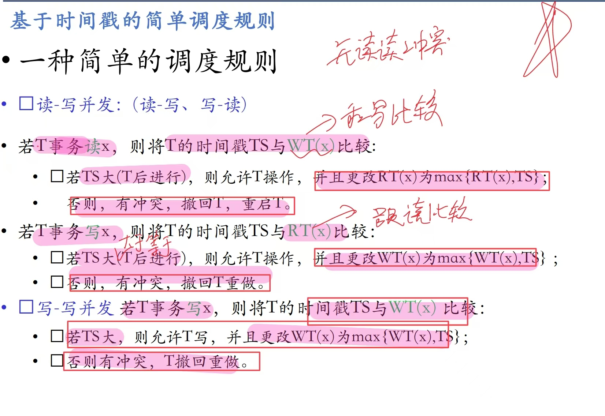
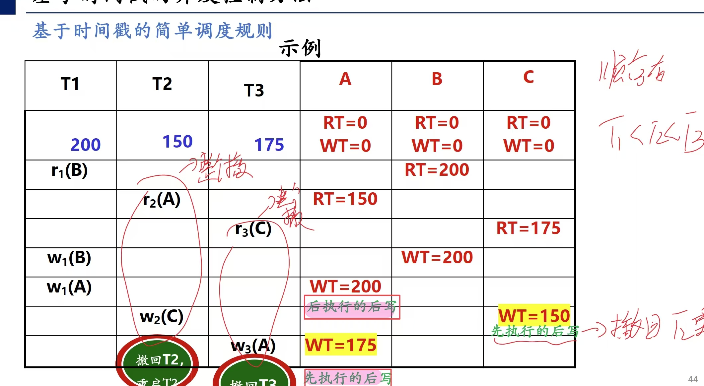
不考托马斯写
